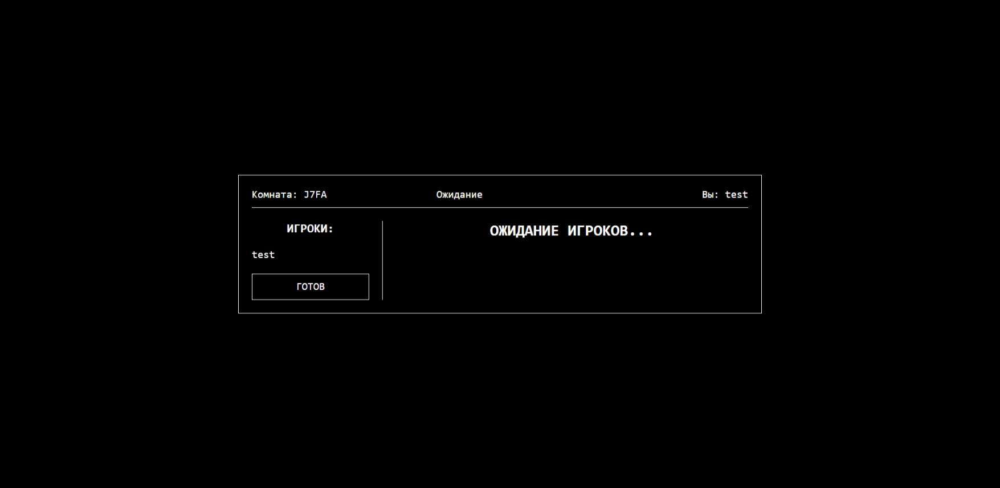

# Static - A Game of Deception & Association



**Static** (formerly *Word Chameleon*) is a minimalist, web-based multiplayer party game about blending in. All players get a secret word, except for one—the Chameleon. Through single-word associations, the group must identify the Chameleon, while the Chameleon must deduce the secret word and pretend to be one of them.

This game is built with a **FastAPI/WebSocket** backend and a pure **HTML/CSS/JS** frontend. It is designed to be lightweight, easy to run, and extremely fast.

**Play the live version here:** [chameleon-game-liv8.onrender.com](https://chameleon-game-liv8.onrender.com)

---

## Gameplay

- **Roles:** At the start of each round, players are secretly assigned a role: `Peaceful` (knows the secret word) or `Chameleon` (doesn't know the word).
- **Association:** In two consecutive rounds, all players simultaneously submit a single word that they associate with the secret word.
- **Deception:** The Chameleon must use the other players' associations to guess the context and provide a word that doesn't blow their cover. The Peaceful players must give clues that are obvious enough for their teammates but vague enough to not give the word away to the Chameleon.
- **Voting:** After two rounds of associations, all players vote on who they believe the Chameleon is.
- **The Reveal:** If the Chameleon is voted out, they get one last chance to win by guessing the secret word. If they succeed, or if the group votes out a Peaceful player, the Chameleon wins!

---

## Tech Stack

This project uses a simple and powerful stack for real-time web applications:

-   **Backend:**
    -   **[FastAPI](https://fastapi.tiangolo.com/):** For the web framework and handling HTTP requests.
    -   **WebSockets:** For real-time, bidirectional communication between the server and clients.
    -   **Python 3:** As the core language for all game logic.
-   **Frontend:**
    -   **HTML5, CSS3, JavaScript:** No frameworks, just pure vanilla JS for a lightweight and fast user interface.
-   **Deployment:**
    -   **[Render](https://render.com/):** Hosting the FastAPI backend (Free Tier).
    -   **[GitHub Pages](https://pages.github.com/):** Hosting the static frontend files.

---

## Getting Started (Local Development)

Want to run the game on your own machine? Follow these steps.

### Prerequisites

-   Python 3.8+
-   `pip` package manager

### 1. Clone the Repository

```bash
git clone https://github.com/lrdcxdes/chameleon-game.git
cd chameleon-game
```

### 2. Install Dependencies

The project's Python dependencies are listed in `requirements.txt`.

```bash
pip install -r requirements.txt
```

### 3. Run the Backend Server

The FastAPI server uses `uvicorn` to run.

```bash
uvicorn main:app --reload```

This will start the server on `http://127.0.0.1:8000`. The `--reload` flag means the server will automatically restart when you make changes to the code.

### 4. Play the Game!

You don't need a separate web server for the frontend. Just open the `index.html` file directly in your web browser:

-   Navigate to the `/templates/` folder in the project.
-   Open `index.html`.

Your browser will load the game, which will automatically try to connect to your local server running on `port 8000`. Open multiple tabs to simulate multiple players.

---

## Project Structure

```
/
|-- main.py             # FastAPI server, WebSocket connection logic
|-- game_logic.py       # Core game state, rules, and timers
|-- requirements.txt    # Python dependencies
|-- words.txt           # The list of secret words
|-- templates/
|   |-- index.html      # Main game page
|-- static/
|   |-- style.css       # All styles
|   |-- script.js       # All client-side logic
|-- .gitignore          # Files to ignore for Git
`-- README.md           # You are here!
```

---
*Created by [lrdcxdes](https://github.com/lrdcxdes).*